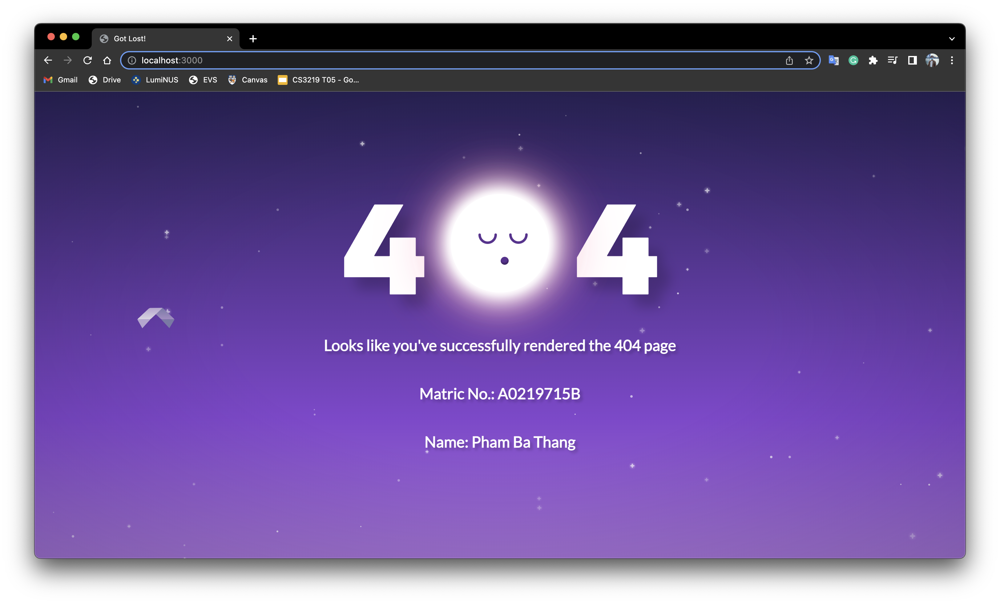
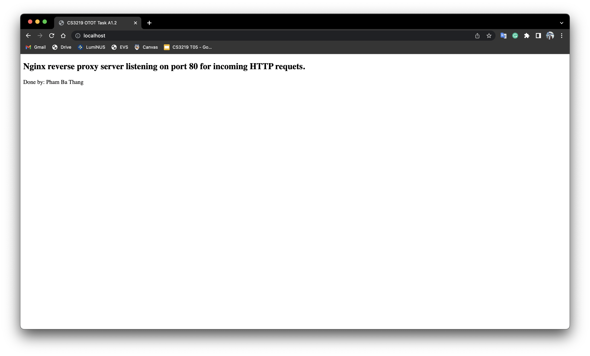

# OTOT Task A1 Report

Name: Pham Ba Thang \
Matric No: A0219715B \
Repo: [https://github.com/pbthang/OTOT-A1](https://github.com/pbthang/OTOT-A1)

## Task A1.1

- Change directory into `./app`
- Build the image:

  ```zsh
    docker build -t otot-a1-app .
  ```

- Run the container:

  ```zsh
  docker run -p 3000:8080 --name otot-a1-app -d otot-a1-app
  ```

If you succeed, you will see this on `localhost:3000`:


## Task A1.2

- Change directory into `./nginx-sample`
- Build the image:

  ```zsh
    docker build -t otot-a1-static .
  ```

- Run the container:

  ```zsh
  docker run -p 80:80 --name otot-a1-static -d otot-a1-static
  ```

- Open [`http://localhost/`](http://localhost/) to see the static html page:
  

## Task A1.3

- Change directory into `./nginx`
- Run `docker-compose up`
- Open `localhost:3000` to see the content (similar to task A1.1)
